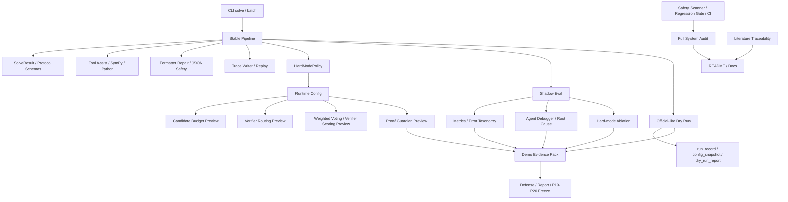

# Intern-S1 Math Agent

> This is **NOT official evaluation**. Default mode is mock-safe. `official_results.jsonl` is never generated by dry-run / demo / audit tools. Real API calls require explicit real / allow-real gates. Do not commit `.env`, `outputs`, traces, caches, or generated submission artifacts.

Intern-S1 Math Agent is an engineering-oriented mathematical-agent system around a stable solver core, mock-safe evaluation harnesses, hard-mode preview controls, proof-specific verification, dry-run submission tooling, demo evidence generation, and full-system audit reports. The project is intentionally organized as a reproducible engineering pipeline rather than a single opaque solver.

## Project Overview

The repository contains five major layers:

1. **Stable solving core**: CLI, pipeline, schemas, mock/real guard, formatter repair, tools, and trace hooks.
2. **Control and verification layer**: hard-mode policy, candidate-budget preview, verifier routing, weighted-voting preview, deterministic verifier scoring, and proof guardian.
3. **Evaluation and debugging layer**: Shadow Eval, metrics, error taxonomy, Agent Debugger, root-cause attribution, and hard-mode ablation.
4. **Submission and evidence layer**: official-like dry run, demo evidence pack, run records, config snapshots, architecture summaries, and report regeneration.
5. **Safety and reproducibility layer**: regression gates, project health report, full system audit, literature traceability, and safety scanner.

The preview layers are deliberately conservative: they expose auditable metadata and evidence before enabling any high-risk override of `final_answer`.

## Full Function Inventory Overview

P18.5.1 expands the full-system audit into an A-X exhaustive function inventory. The generated inventory lives under `outputs/full_system_audit/` when the audit is run; the durable registry is maintained in `scripts/full_system_audit.py`.

| Group | Category | What is audited |
|---|---|---|
| A | Stable Core / 主解题内核 | `CLI solve`, batch entry, pipeline, schemas, mock mode, real API guard, fast/full/tool-first modes, trace writing hook |
| B | Tools / 工具求解层 | SymPy/Python tool solver, answer normalization, tool call records, tool error fallback |
| C | Formatter / JSON 安全层 | Formatter repair, boxed cleanup, dirty-final detection, proof-safe finalize, fallback detection |
| D | Proof Layer / 证明题保护层 | legacy proof guardian, `ProofRubricScore`, `ProofGuardianDecision`, proof metadata plan, proof demo |
| E | Skills / 外化技能层 | skill registry and math/formatter/verifier skill files |
| F | Memory / 外化记忆层 | MemoryHub, error taxonomy, regression cases, route stats, skill success stats, verifier failures |
| G | Protocol / 协议对象层 | `AgentStep`, `ToolCallRecord`, `CandidateAnswer`, `WeightedVoteResult`, metadata sanitization |
| H | Control / Hard-mode 控制层 | `HardModePolicy`, levels, runtime metadata hook, trace policy, proof flag, shadow/debugger requirements |
| I | Weighted Voting / Verifier Scoring | standalone voting, controlled voting preview, answer clustering, verifier scores, proof scoring branch |
| J | Budget Scheduler / 预算控制层 | adaptive budgets, candidate/refine/model-call limits, domain overrides, tool-first decisions |
| K | Evaluation / Shadow Eval | Shadow Eval, metrics, error taxonomy, report builder, JSON validity, boxed/final/proof metrics |
| L | Regression Gate / 质量门禁层 | local regression runner, skip-slow, include-shadow-eval, format/type/test/safety gates |
| M | Agent Debugger / 失败归因层 | failure cases, clusters, root-cause mapping, severity P0/P1/P2, demo case extraction |
| N | Trace / Replay / Observability | trace reader, replay, timeline, trace summary, Markdown replay, redaction and completeness checks |
| O | Demo / Streamlit 展示层 | demo adapter, input/result panels, timeline, tool calls, skill/memory/budget/voting/replay/raw JSON views |
| P | Demo Evidence Pack | demo pack generator, script, architecture/risk/hard-mode/proof/dry-run summaries |
| Q | Hard-mode Ablation | level comparison, verifier routing comparison, proof guardian comparison, debugger integration |
| R | Official-like Dry Run | JSONL input, mock dry run, run id, config snapshot, dry-run report, forbidden `official_results.jsonl` |
| S | Submission / Frozen Export | submission exporter, output JSONL, trace export, run record, README submission, forbidden-file scan |
| T | Offline Evolution / Candidate Archive | evolution skeleton, evidence, manifests, candidate archive, rollback plan |
| U | Safety / Security | `.env`, API key, bearer token, outputs, traces, cache, official result, zip/package risk detection |
| V | Project Health | baseline audit, AGENTS.md, pytest collected count, CI/local gate status, git status, line-count summary |
| W | Docs / Report / README | final report docs, architecture docs, replay docs, submission checklist, proof/hard-mode/audit docs |
| X | Full System Audit | audit script, quality-gate results, smoke results, function inventory, architecture overview |

Generated audit files include:

```text
outputs/full_system_audit/full_system_audit_report.md
outputs/full_system_audit/full_system_audit_summary.json
outputs/full_system_audit/line_count_report.json
outputs/full_system_audit/line_count_report.md
outputs/full_system_audit/quality_gate_results.json
outputs/full_system_audit/functional_smoke_results.json
outputs/full_system_audit/function_inventory.json
outputs/full_system_audit/function_inventory.md
outputs/full_system_audit/function_inventory_by_category.md
outputs/full_system_audit/architecture_overview.md
outputs/full_system_audit/readme_update_notes.md
```

These generated files are runtime artifacts and must not be committed.


## Repository Structure / 目录结构

```text
src/math_agent/
  agents/
  clients/
  control/
  debugger/
  evaluation/
  evidence/
  harness/
  proof/
  submission/
  tools/
  verification/

scripts/
tests/
docs/
skills/
memory/
evolution/
demo/
configs/
```

## Line Count Summary / 代码行数摘要

Run:

```bash
python scripts/full_system_audit.py --out-dir outputs/full_system_audit --skip-slow
```

Then inspect:

```text
outputs/full_system_audit/line_count_report.md
```

The README does not commit dynamic line-count artifacts. The latest numbers must be regenerated locally.

## Current Limitations / 当前限制

- Shadow Eval / audit / dry-run reports are not official accuracy.
- Proof Guardian is deterministic rubric, not a formal proof checker.
- Weighted Voting / verifier scoring are preview or controlled layers unless explicitly enabled.
- Hard-mode defaults to off / preview-safe behavior.
- Official results must only be generated through the final official batch flow.
- Real API evaluation should be performed on the trusted local machine, not in cloud PR checks.
- Literature mapping is traceability evidence, not full paper reproduction.

## Architecture / Full Chain



Short chain:

```text
CLI/Pipeline → tools/formatter/protocol → hard-mode hooks → candidate budget/routing/voting/proof preview → Shadow Eval → Debugger → Ablation → Official-like Dry Run → Demo Evidence Pack → Full System Audit → Safety & Quality Gates → README / final reports
```

## Research Foundation / 研究依据

The design is mapped to eight user-provided reference papers. This mapping is traceability evidence, not a claim that the project fully reproduces those papers.

| Ref | Paper | Core idea used by this project | Project modules | Implementation status |
|---|---|---|---|---|
| [R1] | *Gödel Agent: A Self-Referential Agent Framework for Recursively Self-Improvement* | self-referential agents, recursive improvement, error feedback, tool use | Stable Core, Hard-mode Control, Audit/Trace | engineering adaptation; no unrestricted self-modification |
| [R2] | *Darwin Gödel Machine: Open-Ended Evolution of Self-Improving Agents* | archive-based self-improvement, empirical validation, safety sandboxing, traceability | Shadow Eval, Hard-mode Ablation, Safety, Dry Run | evaluation and evidence inspiration; no open-ended autonomous code rewrite |
| [R3] | *Agentic Harness Engineering* | component / experience / decision observability, Agent Debugger, falsifiable edit contracts | Agent Debugger, Trace/Replay, Demo Evidence Pack, Safety | direct engineering inspiration for evidence and debugging layers |
| [R4] | *Agentic Architect* | seed design, scoring function, simulator/evaluator loop, human-defined search space | Evaluation, Hard-mode Ablation, Dry Run, Full Audit | evaluator/scoring and design-space framing adapted to math-agent context |
| [R5] | *HyperAgents* | task+meta agent integration, metacognitive self-modification, persistent memory, transfer | Hard-mode Control, Memory, Proof Guardian, Project Health | conceptual inspiration; meta-level changes remain controlled and preview-only |
| [R6] | *AutoHarness* | code-as-harness, action verifier, illegal-action prevention, environment feedback | Formatter, Proof Guardian, Safety Scanner, Dry Run | harness/guard philosophy adapted; no learned game harness synthesis |
| [R7] | *CoVerRL* | generator-verifier co-evolution, consensus trap, self-verification, self-correction | Verifier Scoring, Weighted Voting, Proof Guardian | deterministic preview inspired by co-evolution; no RL training |
| [R8] | *Putting the Value Back in RL* | unified reasoner-verifier, generative verifier, weighted voting, test-time compute scaling | WeightedVoteDecision, VerifierScore, candidate grouping | weighted-voting preview and scoring; no unified model training |

Full reference mapping:

```text
docs/literature_traceability.md
docs/reference_mapping.md
```

## System Modules and Research Links

| Module | Files | Related references | Status | Limitation |
|---|---|---|---|---|
| Stable Core / Pipeline | `src/math_agent/pipeline.py`, `src/math_agent/cli.py`, `src/math_agent/schemas.py` | [R1], [R2], [R5] | integrated | controlled pipeline, not unrestricted self-modifying agent |
| Shadow Eval | `src/math_agent/evaluation/**`, `scripts/shadow_eval.py`, `scripts/build_eval_report.py` | [R2], [R3], [R4] | standalone / integrated evidence | mock/preofficial evidence only, not official accuracy |
| Agent Debugger | `src/math_agent/debugger/**`, `scripts/debug_shadow_failures.py` | [R3], [R5] | standalone evidence layer | deterministic attribution, not a learned debugger agent |
| Hard-mode Control | `src/math_agent/control/**` | [R1], [R2], [R5] | preview / metadata hook | default off; no automatic risky override |
| Candidate Budget / Verifier Routing | `src/math_agent/control/candidate_budget.py`, `src/math_agent/control/verifier_routing.py` | [R4], [R7], [R8] | preview | budget/routing metadata, not real multi-solver expansion by default |
| Weighted Voting / Verifier Scoring | `src/math_agent/verification/**`, `src/math_agent/control/weighted_voting_hook.py` | [R7], [R8] | preview / standalone | no RL-trained verifier and no default final answer override |
| Proof Guardian | `src/math_agent/proof/**`, `src/math_agent/control/proof_guardian_hook.py` | [R5], [R7], [R8] | preview / integrated metadata | deterministic rubric, not a formal proof checker |
| Official-like Dry Run | `src/math_agent/submission/**`, `scripts/run_official_dry_run.py` | [R2], [R3], [R4] | standalone harness | explicitly blocks official result naming and real-run misuse |
| Demo Evidence Pack | `src/math_agent/evidence/**`, `scripts/generate_demo_pack.py` | [R2], [R3], [R4] | standalone reporting | aggregates evidence; does not create official metrics |
| Safety / Quality Gates | `scripts/check_project_safety.py`, `scripts/run_regression_gate.py`, `.github/workflows/ci.yml` | [R2], [R3], [R5], [R6] | integrated (workflow file present) | GitHub Actions execution also depends on repository/account settings and permission toggles |
| Full System Audit | `scripts/full_system_audit.py`, `tests/test_full_system_audit.py`, `docs/full_system_audit.md` | [R3], [R4], [R6] | standalone acceptance gate | outputs are generated locally and not committed |
| Literature Traceability | `scripts/check_literature_traceability.py`, `docs/literature_traceability.md`, `docs/reference_mapping.md` | [R1]-[R8] | docs / audit | mapping is evidence of influence, not full reproduction |

## Quick Start

Install the package in a development environment, then run mock-safe commands first:

```bash
python -m math_agent.cli solve --question "计算 2+3" --enable-tools --mode fast --no-trace
python -m math_agent.cli solve --question "计算 2+3" --enable-tools --mode fast --hard-mode --hard-mode-level light --no-trace
```

Run the local regression gate:

```bash
python scripts/run_regression_gate.py --skip-slow --include-shadow-eval
```

## Main Commands

### Base CLI

```bash
python -m math_agent.cli solve --question "计算 2+3" --enable-tools --mode fast --no-trace
```

### Hard-mode preview

```bash
python -m math_agent.cli solve --question "证明偶数加偶数仍为偶数" --enable-tools --mode fast --hard-mode --hard-mode-level strict --no-trace
```

### Shadow Eval

```bash
python scripts/shadow_eval.py --mock --limit 5 --out outputs/shadow_eval_test
python scripts/build_eval_report.py --results outputs/shadow_eval_test/shadow_results.jsonl --out-dir outputs/shadow_eval_test
```

### Agent Debugger

```bash
python scripts/debug_shadow_failures.py --results outputs/shadow_eval_test/shadow_results.jsonl --out-dir outputs/debug_shadow_test
```

### Hard-mode Ablation

```bash
python scripts/run_hard_mode_ablation.py --limit 5 --include-debugger --out-dir outputs/hard_mode_ablation_test
```

### Proof Guardian demo

```bash
python scripts/run_proof_guardian_demo.py --out-dir outputs/proof_guardian_demo_test
```

### Official-like Dry Run

```bash
python scripts/run_official_dry_run.py --input data/preofficial_sample.jsonl --out-dir outputs/official_dry_run_test --limit 5 --enable-tools --mock --no-trace
```

### Demo Evidence Pack

```bash
python scripts/generate_demo_pack.py --out-dir outputs/demo_pack_test
```

### Full System Audit

```bash
python scripts/full_system_audit.py --out-dir outputs/full_system_audit --skip-slow
python scripts/full_system_audit.py --out-dir outputs/full_system_audit
```

### Literature Traceability

```bash
python scripts/check_literature_traceability.py --out-dir outputs/literature_traceability
```

## Quality Gates

The intended quality gate suite is:

```bash
ruff check .
black --check src scripts demo tests
isort --check-only --diff src scripts demo tests
mypy src --show-error-codes
pyright
python -m compileall src scripts demo tests
python -m pytest -q
python scripts/check_project_safety.py
```

`run_regression_gate.py` wraps the local regression gate. The full audit records pass/fail summaries instead of hiding failures.

### 本地完整验收顺序（Pre-submit）

1. 跑质量门禁（ruff / black / isort / mypy / pyright / compileall）。
2. 跑 `python -m pytest -q`。
3. 清理 `.pytest_cache` / `__pycache__` / `outputs/traces` 与临时输出目录。
4. 跑 `python scripts/check_project_safety.py`。
5. 通过后再进入 P19 Frozen Submission / Safety Freeze。

参考清理命令：

```bash
rm -rf .pytest_cache
find . -type d -name "__pycache__" -prune -exec rm -rf {} +
find outputs/traces -mindepth 1 ! -name ".gitkeep" -delete 2>/dev/null || true
rm -rf outputs/full_system_audit outputs/literature_traceability outputs/demo_pack outputs/demo_pack_test outputs/shadow_eval_gate outputs/shadow_eval_test outputs/debug_shadow outputs/debug_shadow_test outputs/hard_mode_ablation outputs/hard_mode_ablation_test outputs/proof_guardian_demo outputs/proof_guardian_demo_test outputs/official_dry_run outputs/official_dry_run_test
```

## Safety Boundaries

- Do not read or commit `.env` content.
- Do not commit `outputs/`, traces, caches, generated submission bundles, or debug artifacts.
- Default commands are mock-safe.
- Real API calls require explicit real / allow-real style gates.
- `official_results.jsonl` is forbidden in dry-run, demo, audit, and safety workflows.
- Preview layers do not change default `final_answer` behavior.
- Literature mapping is traceability evidence, not a claim of full paper reproduction.

## Audit Regeneration

Run:

```bash
python scripts/full_system_audit.py --out-dir outputs/full_system_audit --skip-slow
python scripts/check_literature_traceability.py --out-dir outputs/literature_traceability
```

Then inspect:

```text
outputs/full_system_audit/full_system_audit_report.md
outputs/full_system_audit/function_inventory.md
outputs/full_system_audit/function_inventory_by_category.md
outputs/full_system_audit/line_count_report.md
outputs/literature_traceability/literature_traceability_report.md
```

These files are generated locally and should not be committed.

## Current Module Status

- Stable solver core: integrated.
- Formatter / JSON safety: integrated.
- Proof guardian: preview metadata + deterministic rubric.
- Hard-mode policy: opt-in preview / metadata hook.
- Candidate budget and verifier routing: preview.
- Weighted voting and verifier scoring: standalone + preview metadata.
- Shadow Eval: standalone mock/preofficial evaluation.
- Agent Debugger: standalone failure attribution.
- Official-like Dry Run: standalone mock-safe harness.
- Demo Evidence Pack: standalone report generator.
- Full System Audit: standalone acceptance gate.
- Literature Traceability: docs + static checker.

For the exhaustive A-X inventory, regenerate `outputs/full_system_audit/function_inventory.json`.

## P19 / P20 Roadmap

- **P19 Frozen Submission / Safety Freeze**: freeze commands, freeze configuration, run final safety scan, verify no forbidden artifacts, prepare submission checklist.
- **P20 Final PPT / Paper / Defense Pack**: convert audit, demo evidence, literature mapping, and architecture chain into defense materials.
