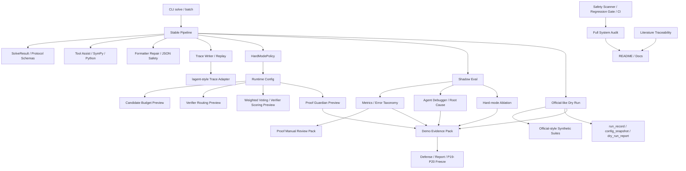

# Intern-S1 Math Agent


Logo concepts are available as separate assets:
`assets/logo-minimal.png`, `assets/logo-mascot.png`, `assets/logo-lineart.png`, and `assets/logo-pixel.png`.

> This is **NOT official evaluation**. Default mode is mock-safe. `official_results.jsonl` is never generated by dry-run / demo / audit tools. Real API calls require explicit real / allow-real gates. Do not commit `.env`, `outputs`, traces, caches, or generated submission artifacts.

Intern-S1 Math Agent is an engineering-oriented mathematical-agent system around a stable solver core, mock-safe evaluation harnesses, hard-mode preview controls, proof-specific verification, dry-run submission tooling, demo evidence generation, and full-system audit reports. The project is intentionally organized as a reproducible engineering pipeline rather than a single opaque solver.

The current final package adds official-style synthetic coverage, proof manual review exports, explicit model/tool separation metrics (`tool_solved_count`, `model_solved_count`, `model_verified_count`, `tool_override_count`), lagent-style trace alignment, and final local gate scripts while preserving the mock-safe default path.

## Project Overview

The repository contains five major layers:

1. **Stable solving core**: CLI, pipeline, schemas, mock/real guard, formatter repair, tools, and trace hooks.
2. **Control and verification layer**: hard-mode policy, candidate-budget preview, verifier routing, weighted-voting preview, deterministic verifier scoring, and proof guardian.
3. **Evaluation and debugging layer**: Shadow Eval, metrics, error taxonomy, Agent Debugger, root-cause attribution, and hard-mode ablation.
4. **Submission and evidence layer**: official-like dry run, official-style synthetic suites, proof review packs, demo evidence pack, run records, config snapshots, architecture summaries, and report regeneration.
5. **Safety and reproducibility layer**: regression gates, pre-submit gate, project health report, full system audit, literature traceability, lagent alignment docs, and safety scanner.

The preview layers are deliberately conservative: they expose auditable metadata and evidence before enabling any high-risk override of `final_answer`.

## Full Function Inventory Overview

P18.5.1 expands the full-system audit into an A-X exhaustive function inventory. The generated inventory lives under `outputs/full_system_audit/` when the audit is run; the durable registry is maintained in `scripts/full_system_audit.py`.

| Group | Category | What is audited |
|---|---|---|
| A | Stable Core / 主解题内核 | `CLI solve`, batch entry, pipeline, schemas, mock mode, real API guard, fast/full/tool-first modes, trace writing hook |
| B | Tools / 工具求解层 | allowlisted SymPy parser, restricted arithmetic AST tool, answer normalization, tool call records, tool error fallback |
| C | Formatter / JSON 安全层 | Formatter repair, boxed cleanup, dirty-final detection, proof-safe finalize, fallback detection |
| D | Proof Layer / 证明题保护层 | legacy proof guardian, `ProofRubricScore`, `ProofGuardianDecision`, proof metadata plan, proof demo |
| E | Skills / 外化技能层 | skill registry and math/formatter/verifier skill files |
| F | Memory / 外化记忆层 | MemoryHub, error taxonomy, regression cases, route stats, skill success stats, verifier failures |
| G | Protocol / 协议对象层 | `AgentStep`, `ToolCallRecord`, `CandidateAnswer`, `WeightedVoteResult`, metadata sanitization |
| H | Control / Hard-mode 控制层 | `HardModePolicy`, levels, runtime metadata hook, trace policy, proof flag, shadow/debugger requirements |
| I | Weighted Voting / Verifier Scoring | standalone voting, controlled voting preview, answer clustering, verifier scores, proof scoring branch |
| J | Budget Scheduler / 预算控制层 | adaptive budgets, candidate/refine/model-call limits, domain overrides, tool-first decisions |
| K | Evaluation / Shadow Eval | Shadow Eval, metrics, error taxonomy, report builder, JSON validity, boxed/final/proof metrics, `tool_solved_count` / `model_solved_count` / `model_verified_count` / `tool_override_count`, explanation quality checks |
| L | Regression Gate / 质量门禁层 | local regression runner, skip-slow, include-shadow-eval, format/type/test/safety gates |
| M | Agent Debugger / 失败归因层 | failure cases, clusters, root-cause mapping, severity P0/P1/P2, demo case extraction |
| N | Trace / Replay / Observability | trace reader, replay, timeline, trace summary, Markdown replay, redaction, completeness checks, lagent-style trace adapter |
| O | Demo / Streamlit 展示层 | demo adapter, input/result panels, timeline, tool calls, skill/memory/budget/voting/replay/raw JSON views |
| P | Demo Evidence Pack | demo pack generator, script, architecture/risk/hard-mode/proof/dry-run summaries |
| Q | Hard-mode Ablation | level comparison, verifier routing comparison, proof guardian comparison, debugger integration |
| R | Official-like Dry Run | JSONL input, mock dry run, official-style synthetic suites, optional real sample gate, run id, config snapshot, dry-run report, forbidden `official_results.jsonl` |
| S | Submission / Frozen Export | submission exporter, output JSONL, trace export, run record, README submission, forbidden-file scan |
| T | Offline Evolution / Candidate Archive | evolution skeleton, evidence, manifests, candidate archive, rollback plan |
| U | Safety / Security | `.env`, API key, bearer token, outputs, traces, cache, official result, raw external output, zip/package risk detection |
| V | Project Health | baseline audit, AGENTS.md, pytest collected count, CI/local gate status, git status, line-count summary |
| W | Docs / Report / README | final report docs, architecture docs, replay docs, submission checklist, proof/hard-mode/audit docs, lagent alignment docs |
| X | Full System Audit | audit script, quality-gate results, smoke results, function inventory, architecture overview |

Generated audit files include:

```text
outputs/full_system_audit/full_system_audit_report.md
outputs/full_system_audit/full_system_audit_summary.json
outputs/full_system_audit/line_count_report.json
outputs/full_system_audit/line_count_report.md
outputs/full_system_audit/quality_gate_results.json
outputs/full_system_audit/functional_smoke_results.json
outputs/full_system_audit/function_inventory.json
outputs/full_system_audit/function_inventory.md
outputs/full_system_audit/function_inventory_by_category.md
outputs/full_system_audit/architecture_overview.md
outputs/full_system_audit/readme_update_notes.md
```

These generated files are runtime artifacts and must not be committed.


## Repository Structure / 目录结构

```text
src/math_agent/
  agents/
  clients/
  control/
  debugger/
  evaluation/
  evidence/
  harness/
  proof/
  submission/
  tools/
  verification/

scripts/
tests/
docs/
data/
skills/
memory/
evolution/
demo/
configs/
```

## Line Count Summary / Code Size

Latest local health check for this working tree (2026-05-30, mock-safe, no real API calls) measured tracked text files only; binary logo assets and generated `outputs/` artifacts are excluded from code-line totals.

| Metric | Count |
|---|---:|
| Total tracked text lines | 24,470 |
| Python lines | 19,536 |
| tests lines | 5,518 |
| scripts lines | 5,089 |
| demo lines | 130 |
| docs Markdown lines | 1,188 |

`scripts/full_system_audit.py` also reports an audit-oriented total of 27,748 lines across tracked text assets, including docs, data, skills, memory, and configuration, while counting binary assets as 0 lines.

Regenerate locally with:

```bash
python scripts/full_system_audit.py --out-dir outputs/full_system_audit --fail-on-risk
```

Then inspect:

```text
outputs/full_system_audit/line_count_report.md
```

## Current Limitations / 当前限制

- Shadow Eval / audit / dry-run reports are not official accuracy.
- Proof Guardian is deterministic rubric, not a formal proof checker.
- Weighted Voting / verifier scoring are preview or controlled layers unless explicitly enabled.
- Hard-mode defaults to off / preview-safe behavior.
- Official results must only be generated through the final official batch flow.
- `official_style_*` datasets are synthetic official-style regression assets and must not be described as official hidden data.
- Real API evaluation should be performed on the trusted local machine, not in cloud PR checks.
- Real API gates are opt-in only; default workflows remain mock-safe.
- lagent support is currently a trace/alignment adapter, not a runtime replacement for the stable pipeline.
- Literature mapping is traceability evidence, not full paper reproduction.

## Architecture / Full Chain



Short chain:

```text
CLI/Pipeline → tools/formatter/protocol → hard-mode hooks → candidate budget/routing/voting/proof preview → Shadow Eval → Debugger → Ablation → Official-style Synthetic Gates → Proof Review Pack → lagent-style Trace Adapter → Demo Evidence Pack → Full System Audit → Safety & Quality Gates → README / final reports
```

## Research Foundation / 研究依据

The design is mapped to eight user-provided reference papers. This mapping is traceability evidence, not a claim that the project fully reproduces those papers.

Competition reference alignment is also tracked through the Intern-S1 client boundary, centralized prompt ownership, official-style synthetic gates, proof review packs, and the lagent-style trace adapter. The adapter provides architecture and trace compatibility without changing the stable runtime.

| Ref | Paper | Core idea used by this project | Project modules | Implementation status |
|---|---|---|---|---|
| [R1] | *Gödel Agent: A Self-Referential Agent Framework for Recursively Self-Improvement* | self-referential agents, recursive improvement, error feedback, tool use | Stable Core, Hard-mode Control, Audit/Trace | engineering adaptation; no unrestricted self-modification |
| [R2] | *Darwin Gödel Machine: Open-Ended Evolution of Self-Improving Agents* | archive-based self-improvement, empirical validation, safety sandboxing, traceability | Shadow Eval, Hard-mode Ablation, Safety, Dry Run | evaluation and evidence inspiration; no open-ended autonomous code rewrite |
| [R3] | *Agentic Harness Engineering* | component / experience / decision observability, Agent Debugger, falsifiable edit contracts | Agent Debugger, Trace/Replay, Demo Evidence Pack, Safety | direct engineering inspiration for evidence and debugging layers |
| [R4] | *Agentic Architect* | seed design, scoring function, simulator/evaluator loop, human-defined search space | Evaluation, Hard-mode Ablation, Dry Run, Full Audit | evaluator/scoring and design-space framing adapted to math-agent context |
| [R5] | *HyperAgents* | task+meta agent integration, metacognitive self-modification, persistent memory, transfer | Hard-mode Control, Memory, Proof Guardian, Project Health | conceptual inspiration; meta-level changes remain controlled and preview-only |
| [R6] | *AutoHarness* | code-as-harness, action verifier, illegal-action prevention, environment feedback | Formatter, Proof Guardian, Safety Scanner, Dry Run | harness/guard philosophy adapted; no learned game harness synthesis |
| [R7] | *CoVerRL* | generator-verifier co-evolution, consensus trap, self-verification, self-correction | Verifier Scoring, Weighted Voting, Proof Guardian | deterministic preview inspired by co-evolution; no RL training |
| [R8] | *Putting the Value Back in RL* | unified reasoner-verifier, generative verifier, weighted voting, test-time compute scaling | WeightedVoteDecision, VerifierScore, candidate grouping | weighted-voting preview and scoring; no unified model training |

Full reference mapping:

```text
docs/literature_traceability.md
docs/reference_mapping.md
```

## System Modules and Research Links

| Module | Files | Related references | Status | Limitation |
|---|---|---|---|---|
| Stable Core / Pipeline | `src/math_agent/pipeline.py`, `src/math_agent/cli.py`, `src/math_agent/schemas.py` | [R1], [R2], [R5] | integrated | controlled pipeline, not unrestricted self-modifying agent |
| Shadow Eval | `src/math_agent/evaluation/**`, `scripts/shadow_eval.py`, `scripts/build_eval_report.py` | [R2], [R3], [R4] | standalone / integrated evidence | mock/preofficial evidence only, not official accuracy |
| Agent Debugger | `src/math_agent/debugger/**`, `scripts/debug_shadow_failures.py` | [R3], [R5] | standalone evidence layer | deterministic attribution, not a learned debugger agent |
| Hard-mode Control | `src/math_agent/control/**` | [R1], [R2], [R5] | preview / metadata hook | default off; no automatic risky override |
| Candidate Budget / Verifier Routing | `src/math_agent/control/candidate_budget.py`, `src/math_agent/control/verifier_routing.py` | [R4], [R7], [R8] | preview | budget/routing metadata, not real multi-solver expansion by default |
| Weighted Voting / Verifier Scoring | `src/math_agent/verification/**`, `src/math_agent/control/weighted_voting_hook.py` | [R7], [R8] | preview / standalone | no RL-trained verifier and no default final answer override |
| Proof Guardian | `src/math_agent/proof/**`, `src/math_agent/control/proof_guardian_hook.py` | [R5], [R7], [R8] | preview / integrated metadata | deterministic rubric, not a formal proof checker |
| Official-like Dry Run | `src/math_agent/submission/**`, `scripts/run_official_dry_run.py` | [R2], [R3], [R4] | standalone harness | explicitly blocks official result naming and real-run misuse |
| Official-style Synthetic Gates | `data/official_style_18domain_112*.jsonl`, `scripts/generate_official_style_18domain_112.py`, `scripts/run_real_api_sample_gate.py` | [R2], [R3], [R4] | standalone / opt-in real gate | synthetic data only; real gate requires explicit local approval |
| Proof Review Pack | `src/math_agent/evaluation/proof_review.py`, `scripts/build_proof_review_pack.py` | [R5], [R7], [R8] | standalone report export | supports manual review, not formal proof verification |
| lagent Trace Alignment | `src/math_agent/harness/lagent_trace_adapter.py`, `docs/lagent_alignment.md` | [R3], [R6] | adapter / documentation | no lagent runtime dependency in stable path |
| Demo Evidence Pack | `src/math_agent/evidence/**`, `scripts/generate_demo_pack.py` | [R2], [R3], [R4] | standalone reporting | aggregates evidence; does not create official metrics |
| Safety / Quality Gates | `scripts/check_project_safety.py`, `scripts/run_regression_gate.py`, `.github/workflows/ci.yml` | [R2], [R3], [R5], [R6] | integrated (workflow file present) | GitHub Actions execution also depends on repository/account settings and permission toggles |
| Full System Audit | `scripts/full_system_audit.py`, `tests/test_full_system_audit.py`, `docs/full_system_audit.md` | [R3], [R4], [R6] | standalone acceptance gate | outputs are generated locally and not committed |
| Literature Traceability | `scripts/check_literature_traceability.py`, `docs/literature_traceability.md`, `docs/reference_mapping.md` | [R1]-[R8] | docs / audit | mapping is evidence of influence, not full reproduction |

## Quick Start

Install the package in a development environment, then run mock-safe commands first:

```bash
python -m math_agent.cli solve --question "计算 2+3" --enable-tools --mode fast --no-trace --fail-on-non-success
python -m math_agent.cli solve --question "计算 2+3" --enable-tools --mode fast --hard-mode --hard-mode-level light --no-trace
```

Run the local regression gate:

```bash
python scripts/run_regression_gate.py --skip-slow --include-shadow-eval
```

Generate the official-style synthetic suite and run the final local pre-submit gate:

```bash
python scripts/generate_official_style_18domain_112.py
python scripts/run_pre_submit_gate.py
```

## Main Commands

### Base CLI

```bash
python -m math_agent.cli solve --question "计算 2+3" --enable-tools --mode fast --no-trace
```

### Hard-mode preview

```bash
python -m math_agent.cli solve --question "证明偶数加偶数仍为偶数" --enable-tools --mode fast --hard-mode --hard-mode-level strict --no-trace
```

### Shadow Eval

```bash
python scripts/shadow_eval.py --mock --limit 5 --out outputs/shadow_eval_test
python scripts/build_eval_report.py --results outputs/shadow_eval_test/shadow_results.jsonl --out-dir outputs/shadow_eval_test
```

### Agent Debugger

```bash
python scripts/debug_shadow_failures.py --results outputs/shadow_eval_test/shadow_results.jsonl --out-dir outputs/debug_shadow_test
```

### Hard-mode Ablation

```bash
python scripts/run_hard_mode_ablation.py --limit 5 --include-debugger --out-dir outputs/hard_mode_ablation_test
```

### Proof Guardian demo

```bash
python scripts/run_proof_guardian_demo.py --out-dir outputs/proof_guardian_demo_test
```

### Official-like Dry Run

```bash
python scripts/run_official_dry_run.py --input data/preofficial_sample.jsonl --out-dir outputs/official_dry_run_test --limit 5 --enable-tools --mock --no-trace
```

Each traced dry run uses a new `<trace-base>/<run_id>/` directory and binds its
results to a rechecked input-manifest SHA-256 plus the exact execution profile.
CLI resume accepts a prior success only when the canonical question, prompt
snapshot, execution profile, result, and trace evidence all match; legacy or
incomplete provenance is rerun. The frozen exporter independently validates the
same bindings, scans every selected text source, and accepts only a canonical ZIP
with no unmanifested prefix, comments, record gaps, or trailing bytes.

### Official-style Synthetic Gates

```bash
python scripts/generate_official_style_18domain_112.py
python scripts/run_benchmark_suite.py --input data/official_style_18domain_112.jsonl --answers data/official_style_18domain_112_answers.jsonl --out-dir outputs/benchmark_suite --limit 36 --enable-tools --mode-pattern fast,tool-first --ab-limit 0
python scripts/run_real_api_sample_gate.py --input data/official_style_18domain_112.jsonl --answers data/official_style_18domain_112_answers.jsonl --out-dir outputs/real_api_sample_gate --per-domain 2 --real --allow-real --max-attempts 2
python scripts/run_real_api_sample_gate.py --input data/official_style_18domain_112.jsonl --answers data/official_style_18domain_112_answers.jsonl --out-dir outputs/real_api_sample_gate_rerun --rerun-failures-from outputs/real_api_sample_gate/failure_replay_report.json --real --allow-real --max-attempts 2
python scripts/check_gate_environment.py --out-dir outputs/gate_environment
python scripts/build_proof_review_pack.py --results outputs/benchmark_suite/mixed_official_like/results.jsonl --answers data/official_style_18domain_112_answers.jsonl --trace-dir outputs/benchmark_suite/mixed_official_like/traces
python scripts/build_final_submission_report.py --real-api-summary outputs/real_api_sample_gate/real_api_sample_gate_summary.json --domain-dashboard outputs/real_api_sample_gate/domain_dashboard.json --failure-report outputs/real_api_sample_gate/failure_replay_report.json --out-dir outputs/final_submission_report
```

`official_style_*` datasets are synthetic official-style regression data, not official hidden-set data. `run_real_api_sample_gate.py` is an explicit opt-in local audit command; it performs a one-call real API preflight by default so network/auth failures do not masquerade as model failures. Raw traces/results must not be committed.
The automatic gate defaults to short-answer samples. `--include-proof` creates a proof review pack and intentionally requires external semantic review instead of auto-certifying proof correctness.
The failure rerun command uses the generated failure replay JSON to rerun only fail/partial cases, saving real API tokens while preserving the no-manual-result-editing rule; its summary is labeled `failure_subset` and is not a replacement for the full 18-domain gate.
The gate environment report checks local lint/type tools and real API environment readiness without printing secrets, helping distinguish setup blockers from model or pipeline failures.
The final submission report builder summarizes gate evidence, real API metrics, failure closure buckets, and lagent alignment without copying raw traces or secrets.
The canonical synthetic hard-suite generator now writes `data/synthetic_hard_math*.jsonl` by default; any remaining `hard_hidden_*` fixtures are legacy synthetic regression assets and are not official hidden-set data.

### lagent Trace Alignment

```bash
python -m pytest -q tests/test_lagent_trace_adapter.py
python scripts/build_final_submission_report.py --out-dir outputs/final_submission_report
```

The stable runtime does not depend on `lagent`; this is an evidence and trace-alignment layer for reviewer readability. See `docs/lagent_alignment.md` for the full mapping between this project's planner/solver/verifier/tool traces and lagent-style agent/action/observation concepts.

| Project stage | lagent concept | Evidence source | Review proof |
|---|---|---|---|
| Planner | Agent message | `model_calls[stage=planner]` | planning intent exports as a sanitized assistant message |
| Solver | Agent message | `model_calls[stage=solver]` | solver call metadata exports without secrets |
| Verifier | Agent message / critic | `final_result.verification` | verification status and method appear in the final trace view |
| Tool Observation | Action observation | `tool_calls[]` | tool name, status, latency, and summary map to action observations |

This keeps the official-reference alignment visible while avoiding a risky runtime swap before the real API 18-domain gate is stable.

### Demo Evidence Pack

```bash
python scripts/generate_demo_pack.py --out-dir outputs/demo_pack_test
```

### Full System Audit

```bash
python scripts/full_system_audit.py --out-dir outputs/full_system_audit --fail-on-risk
```

### Literature Traceability

```bash
python scripts/check_literature_traceability.py --out-dir outputs/literature_traceability
```

## Quality Gates

The canonical local gate uses Python-module entry points so it works even when console scripts are not on `PATH`:

```bash
python scripts/run_regression_gate.py
python scripts/run_pre_submit_gate.py --dry-run-limit 3
python scripts/full_system_audit.py --out-dir outputs/full_system_audit --fail-on-risk
python scripts/check_gate_environment.py --out-dir outputs/gate_environment
python scripts/clean_transient_artifacts.py --quiet
python scripts/check_project_safety.py
```

Equivalent expanded checks:

```bash
python -m ruff check .
python -m black --check src scripts demo tests
python -m isort --check-only --diff src scripts demo tests
python -m mypy src --show-error-codes
python -m pyright --pythonpath <path-to-current-python>
python -m compileall src scripts demo tests
python -m pytest -q
python -m math_agent.cli solve --question "计算 2+3" --enable-tools --mode fast --no-trace --fail-on-non-success
python scripts/check_project_safety.py
```

`run_regression_gate.py` wraps lint, format, import, type, compile, pytest, CLI smoke, cleanup, and safety checks. `run_pre_submit_gate.py` wraps the final local gate: pytest, official-style mock dry-run, cleanup, and safety scan. `full_system_audit.py --fail-on-risk` records pass/fail summaries and exits non-zero on skipped or failed checks. A final evidence report can be assembled from `docs/final_submission_report_template.md` or generated with `scripts/build_final_submission_report.py` after the real sample gate has produced local summaries.

For automation, pass `--fail-on-non-success` to `solve` or `batch`; the default exit-code behavior remains compatible with callers that treat a schema-valid failure result as a completed invocation.

The default pre-submit mock dry run is a structural and safety gate: it fails on
invalid rows or missing final values, but does not pretend that unsupported mock
questions were semantically solved. Use `--require-mock-success` only with an
input set known to be deterministically mock-solvable.

Latest local validation for this working tree (2026-07-11, no real API calls):

| Command | Result | Key output |
|---|---|---|
| `python scripts/run_regression_gate.py` | PASS | 919 passed, 3 skipped; provenance, Ruff, Black, isort, mypy, pyright, compileall, CLI smoke, cleanup, safety PASS |
| `python scripts/run_pre_submit_gate.py --dry-run-limit 3` | PASS | 919 passed, 3 skipped; 3-row structural mock dry-run, cleanup, safety PASS |
| `python -m pytest -q` | PASS | 919 passed, 3 skipped (inside both final gates) |
| `python scripts/check_project_safety.py` | PASS | no forbidden or suspected-sensitive artifacts after cleanup |
| `pip-audit` against runtime/dev hash locks | PASS | no known vulnerabilities in 22 runtime / 82 dev locked packages at audit time |

Windows note: use a UTF-8 capable terminal when reading Chinese logs or docs. If PowerShell displays garbled text, run `chcp 65001` before printing Markdown files.

Final pre-submit shortcut:

```bash
python scripts/run_pre_submit_gate.py
```

## Safety Boundaries

- Do not read or commit `.env` content.
- Do not commit `outputs/`, traces, caches, generated submission bundles, or debug artifacts.
- Default commands are mock-safe.
- Real API calls require explicit real / allow-real style gates plus
  `INTERNS1_ALLOWED_HOSTS`, a comma-separated exact-host allowlist matching
  `INTERNS1_BASE_URL`; IP literals, localhost, single-label and private-style
  hostnames are rejected before the authorization secret reaches the transport.
  The isolated HTTP worker resolves once, rejects every non-global or mixed
  address set, pins that result for the HTTPS connection, and authorizes HTTPS
  port 443 only.
- The Streamlit app is a local mock-only preview. It uses a server-owned,
  per-session trace directory and only replays trace IDs enumerated for that
  session. Questions are limited to 8,192 characters / 32 KiB UTF-8; per-session
  and whole-service file/byte/TTL ceilings, a 30-solves/minute global window, and
  bounded new/active-session admission fail closed. It is still not an
  authenticated public real-API service.
- Do not place API keys, raw external outputs, or trace excerpts in repository docs.
- `official_style_*` datasets are synthetic official-style regression data, not official hidden data.
- `official_results.jsonl` is forbidden in dry-run, demo, audit, and safety workflows.
- Preview layers do not change default `final_answer` behavior.
- `python_sandbox` interprets an arithmetic-only AST subset; imports, attributes, loops, definitions, comprehensions, and arbitrary Python bytecode execution are intentionally unavailable. Symbolic work goes through the dedicated allowlisted SymPy tools.
- SymPy validates numeric exponent nodes before and after bounded recursive
  normalization of nested exponent trees; normalization has explicit operation
  and node ceilings and never invokes unrestricted general simplification.
- Python, SymPy, and HTTP workers share one bounded process budget; overload is
  rejected instead of spawning an unbounded number of child processes.
- Project safety checks explicitly reject credential-container suffixes, scan
  bounded binary content for high-confidence formats, and scan bounded reachable
  Git commit/tag messages plus text-forced patch history without printing matched
  content. Test fixtures are scrubbed only for current, explicitly marked files
  and exact synthetic values.
- Git history scanning resolves an absolute executable only from explicit PATH
  directories outside the repository and current working directory. Git children
  run from that verified executable directory with current-directory executable
  search disabled; the repository is selected only through `git -C <root>`.
- Trace directory budgets use descriptor-verified `file_bytes`; redacted display
  paths are never reused as internal filesystem paths by batch/resume accounting.
- Generic text/JSON redaction never trusts a hash-looking field name. Only
  explicit program-owned trace and dry-run artifact writers preserve exact
  lowercase SHA-256 provenance paths.
- lagent alignment is an adapter/documentation layer; runtime lagent integration should remain a separate opt-in task.
- Literature mapping is traceability evidence, not a claim of full paper reproduction.

## Audit Regeneration

Run:

```bash
python scripts/full_system_audit.py --out-dir outputs/full_system_audit --skip-slow
python scripts/check_literature_traceability.py --out-dir outputs/literature_traceability
python scripts/build_proof_review_pack.py --results outputs/benchmark_suite/mixed_official_like/results.jsonl --answers data/official_style_18domain_112_answers.jsonl --trace-dir outputs/benchmark_suite/mixed_official_like/traces
```

Then inspect:

```text
outputs/full_system_audit/full_system_audit_report.md
outputs/full_system_audit/function_inventory.md
outputs/full_system_audit/function_inventory_by_category.md
outputs/full_system_audit/line_count_report.md
outputs/literature_traceability/literature_traceability_report.md
outputs/benchmark_suite/mixed_official_like/proof_manual_review_pack.md
```

These files are generated locally and should not be committed.

## Current Module Status

- Stable solver core: integrated.
- Formatter / JSON safety: integrated.
- Proof guardian: preview metadata + deterministic rubric.
- Hard-mode policy: opt-in preview / metadata hook.
- Candidate budget and verifier routing: preview.
- Weighted voting and verifier scoring: standalone + preview metadata.
- Shadow Eval: standalone mock/preofficial evaluation.
- Official-style 18-domain Suite: synthetic regression data + generator.
- Real API Sample Gate: explicit opt-in local audit script with transient retry.
- Proof Review Pack: standalone export for proof text, rubric reasons, scores, and risk flags.
- lagent Trace Alignment: adapter + documentation, no runtime dependency.
- Agent Debugger: standalone failure attribution.
- Official-like Dry Run: standalone mock-safe harness.
- Demo Evidence Pack: standalone report generator.
- Full System Audit: standalone acceptance gate.
- Literature Traceability: docs + static checker.

For the exhaustive A-X inventory, regenerate `outputs/full_system_audit/function_inventory.json`.

## P19 / P20 Roadmap

- **P19 Frozen Submission / Safety Freeze**: freeze commands, freeze configuration, run final safety scan, verify no forbidden artifacts, verify official-style synthetic gates, and prepare submission checklist.
- **P20 Final PPT / Paper / Defense Pack**: convert audit, demo evidence, proof review packs, literature mapping, lagent alignment, and architecture chain into defense materials.
