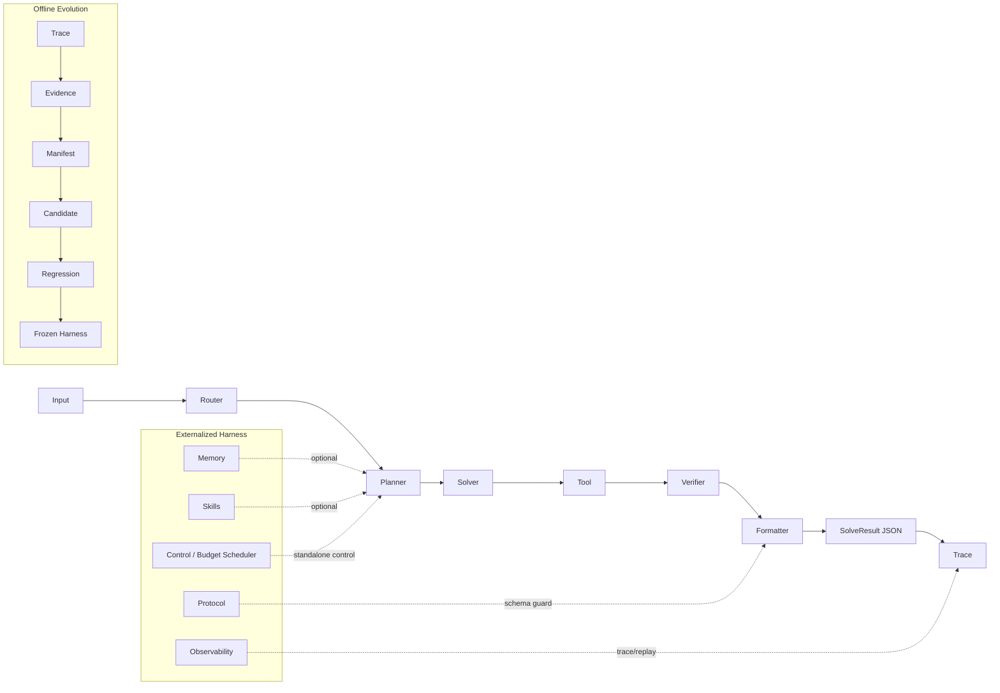

# EvoExternMath-S1++ Architecture

## 1) 总体架构图（Mermaid）

## 2) 主链路说明
- 主链路保持稳定：Input → Router → Planner → Solver → Tool → Verifier → Formatter → SolveResult JSON → Trace。
- 本阶段不改 pipeline，不改 CLI solve / batch 行为。

## 3) 外化层说明
- Memory / Skills / Protocol / Control / Observability 以 Harness 形式外置。
- 目标是增强能力可插拔、可关闭、可审计，不破坏 stable core。

## 4) 离线层说明
- 离线链路：Trace → Evidence → Manifest → Candidate → Regression → Frozen Harness。
- 离线优化仅用于候选策略筛选与回归验证，不进行在线自改代码。

## 5) 模块状态

### 已实现（可在仓库中找到实现与测试）
- Stable pipeline（核心流程）
- Formatter Repair v1
- Proof Guardian v1
- Skill Library v1
- MemoryHub v1
- Protocol Schema v1
- Trace Replay v1
- Streamlit Demo 升级
- Offline Evolution skeleton
- Frozen Submission exporter

### standalone（已实现但未接入主流程）
- Weighted Voting standalone
- Budget Scheduler standalone

### 后续扩展方向
- Verifier-Gated Weighted Voting 的受控接入评估
- Adaptive Budget 策略灰度实验
- Offline Evolution 从 skeleton 到完整自动候选筛选
