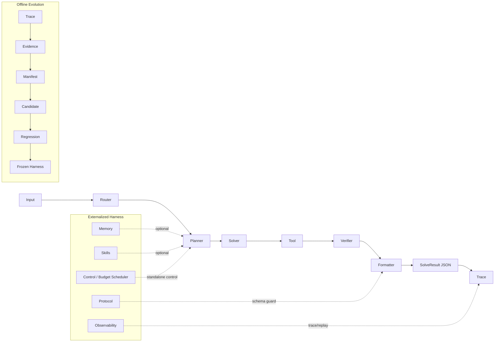

# EvoExternMath-S1++ Architecture

## 1) 总体架构图（Mermaid）

```mermaid
flowchart LR
    A[Input] --> B[Router]
    B --> C[Planner]
    C --> D[Solver]
    D --> E[Tool]
    E --> F[Verifier]
    F --> G[Formatter]
    G --> H[SolveResult JSON]
    H --> I[Trace]

    subgraph Externalized Harness
      M[Memory]
      S[Skills]
      P[Protocol]
      K[Control / Budget Scheduler]
      O[Observability]
    end

    M -.optional.-> C
    S -.optional.-> C
    P -.schema guard.-> G
    K -.standalone control.-> C
    O -.trace/replay.-> I

    subgraph Offline Evolution
      T[Trace]
      E2[Evidence]
      M2[Manifest]
      C2[Candidate]
      R[Regression]
      F2[Frozen Harness]
    end

    T --> E2 --> M2 --> C2 --> R --> F2
```

## 2) 主链路说明
- 主链路拓扑保持稳定：Input → Router → Planner → Solver → Tool → Verifier → Formatter → SolveResult JSON → Trace；没有改成新的编排框架或产品级 MultiAgent。
- `pipeline.py` 的内部实现已经加入执行 provenance、严格成功契约、trace 完整性校验和失败关闭处理，但没有改变上述阶段顺序、默认 `mock` 模式或 `full` / `fast` / `tool-first` 运行模式。
- CLI 继续提供兼容的 `solve` / `batch` 主入口；新增参数均为显式 opt-in。`SolveResult` 增加输入与执行指纹，因此对忽略额外 JSON 字段的调用方保持兼容，但不承诺与旧版本字节级完全一致。

## 3) 运行时安全边界
- `security.py` 与 `io_utils.py` 统一处理脱敏、严格 JSON、有界 I/O、路径和文件身份校验。
- Python、SymPy 和真实 HTTP 请求通过 `process_isolation.py` 及专用 worker 执行，共用有界并发、超时和资源预算；这些 worker 是本地隔离子进程，不是独立微服务。
- result、trace、resume、metrics 与 submission 通过输入指纹、执行 profile 和 execution fingerprint 建立一致性约束。

## 4) 外化层说明
- Memory / Skills / Protocol / Control / Observability 以 Harness 形式外置。
- 目标是增强能力可插拔、可关闭、可审计，不破坏 stable core。

## 5) 离线层说明
- 离线链路：Trace → Evidence → Manifest → Candidate → Regression → Frozen Harness。
- 离线优化仅用于候选策略筛选与回归验证，不进行在线自改代码。

## 6) 模块状态

### 已实现（可在仓库中找到实现与测试）
- Stable pipeline（核心流程）
- Formatter Repair v1
- Proof Guardian v1
- Skill Library v1
- MemoryHub v1
- Protocol Schema v1
- Trace Replay v1
- Streamlit Demo 升级
- 严格 I/O、provenance 与进程隔离安全层
- Offline Evolution skeleton
- Frozen Submission exporter

### 受控 preview / standalone
- Weighted Voting / Verifier Scoring：默认关闭或仅记录 preview 决策，不覆盖主路径最终答案
- Budget Scheduler / Hard Mode：受控 preview，不改变默认执行模式
- MemoryHub：能力已实现，默认不写入
- lagent：仅提供 trace/alignment adapter，不替换 stable pipeline runtime

### 后续扩展方向
- Verifier-Gated Weighted Voting 的受控接入评估
- Adaptive Budget 策略灰度实验
- Offline Evolution 从 skeleton 到完整自动候选筛选
- 产品级 MultiAgent 仍不在当前接入范围
